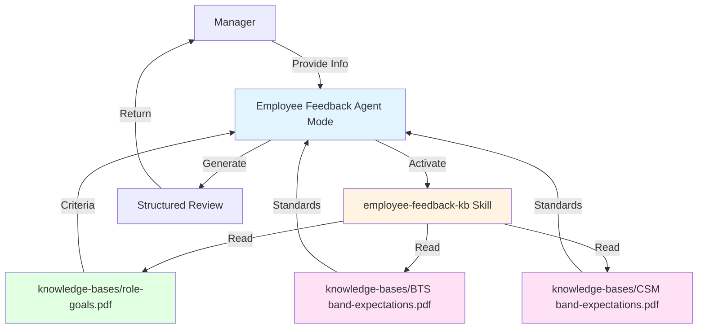

# Employee Feedback Agent

An AI-powered performance review assistant for Brand Technical Specialists (BTS) and Client Success Managers (CSM) in salary bands 6-10. Runs locally in **IBM Bob** — no watsonx Orchestrate deployment required.

## Overview

This agent helps managers create comprehensive, structured performance reviews by:
1. Collecting employee information through a guided conversation
2. Reading local knowledge base PDFs (role goals and band expectations)
3. Analyzing performance against established organizational standards
4. Generating structured feedback in the correct format for the review type

## Quick Start (Run in Bob)

### Prerequisites

- [IBM Bob](https://www.ibm.com/products/watsonx-orchestrate) installed
- This repository cloned locally:
  ```bash
  git clone https://github.com/Tadanntlewis/employee-feedback-agent.git
  cd employee-feedback-agent
  ```
- The knowledge base PDFs in the `knowledge-bases/` folder (already included):
  - `knowledge-bases/role-goals.pdf`
  - `knowledge-bases/BTS band-expectations.pdf`
  - `knowledge-bases/CSM band-expectations.pdf`

### Setup (One Time)

The Bob mode and skill are already configured in this repository under `.bob/`. When you open this folder as your workspace in Bob, they load automatically — no installation steps needed.

### Using the Agent

1. **Open this project folder as your workspace in Bob**
2. **Select "Employee Feedback Agent"** from the mode picker (bottom of the screen)
3. **Start a new conversation** and tell the agent who you need to create a review for
4. The agent will guide you through the intake process step by step
5. When it needs role goals or band expectations, it will activate the `/employee-feedback-kb` skill and read the local PDFs automatically

## Architecture



## Project Structure

```
employee-feedback-agent/
├── .bob/
│   ├── custom_modes.yaml               # Bob mode definition (the agent persona)
│   └── skills/
│       └── employee-feedback-kb/
│           └── SKILL.md                # KB skill (reads local PDFs into context)
├── agents/
│   └── employee_feedback_agent.yaml    # Original WXO agent config (reference only)
├── knowledge-bases/
│   ├── role-goals.pdf                  # Role goals for BTS and CSM
│   ├── BTS band-expectations.pdf       # BTS band 6-10 expectations
│   ├── CSM band-expectations.pdf       # CSM band 6-10 expectations
│   ├── role-goals-kb.yaml              # WXO KB config (reference only)
│   └── band-expectations-kb.yaml       # WXO KB config (reference only)
├── employee-self-assessment-template.md
├── employee-self-feedback-quarterly.md
├── employee-self-feedback-yearly.md
└── README.md
```

## Review Types & Formats

### Quarterly & Mid-Year Reviews
Two focused sections:
1. **What Went Well?** — accomplishments, strengths, positive outcomes
2. **What Could Be Improved?** — development areas, constructive feedback

### Year-End Reviews
Four comprehensive sections:
1. **Business Outcomes Summary** — business impact and results
2. **Skills Outcomes Summary** — technical and professional skills
3. **Behaviors Outcomes Summary** — leadership, collaboration, cultural alignment
4. **Manager Evaluation Summary** — performance segment (1-5) and manager comments

## Supported Roles

### Brand Technical Specialist (BTS)
Evaluation covers: Technical Excellence, Brand Knowledge and Advocacy, Client Relationship Management, Innovation and Problem-Solving, Collaboration and Knowledge Sharing, Band-Level Competencies

### Client Success Manager (CSM)
Evaluation covers: Client Relationship Excellence, Revenue Growth and Account Expansion, Client Advocacy and Success, Proactive Account Management, Strategic Planning and Execution, Band-Level Competencies

## Supported Salary Bands

Bands 6–10, with role-specific competency and experience expectations at each level.

## Example Conversation

```
Manager: I need to create a Q1 review for Sarah Johnson

Agent: I'll help you create a performance review. Let me gather some information.
       What is Sarah's role? (BTS or CSM)

Manager: CSM

Agent: What is Sarah's current salary band? (6-10)

Manager: Band 8

Agent: What review period is this for?
...
[Agent loads KB PDFs, gathers all inputs, then generates structured review]
```

## Customizing the Agent

- **Update evaluation criteria**: Replace the PDFs in `knowledge-bases/`
- **Change agent behavior**: Edit `.bob/custom_modes.yaml` (the `roleDefinition` field)
- **Adjust KB loading**: Edit `.bob/skills/employee-feedback-kb/SKILL.md`

## Optional: Deploy to watsonx Orchestrate

The original WXO deployment files are still present for teams that want to deploy this agent to watsonx Orchestrate:

```bash
# Import knowledge bases
orchestrate kb import knowledge-bases/role-goals-kb.yaml
orchestrate kb import knowledge-bases/band-expectations-kb.yaml

# Import agent
orchestrate agent import agents/employee_feedback_agent.yaml
```

See `DEPLOYMENT-CHECKLIST.md` for full WXO deployment instructions.

## Self-Assessment Templates

Employee self-assessment templates are included for use alongside the agent:

- [`employee-self-assessment-template.md`](employee-self-assessment-template.md) — General template
- [`employee-self-feedback-quarterly.md`](employee-self-feedback-quarterly.md) — Quarterly/Mid-Year format
- [`employee-self-feedback-yearly.md`](employee-self-feedback-yearly.md) — Year-End format

## Resources

- [IBM Bob Documentation](https://www.ibm.com/products/watsonx-orchestrate)
- [watsonx Orchestrate Developer Docs](https://developer.watson-orchestrate.ibm.com/)
- [GitHub Repository](https://github.com/Tadanntlewis/employee-feedback-agent)
