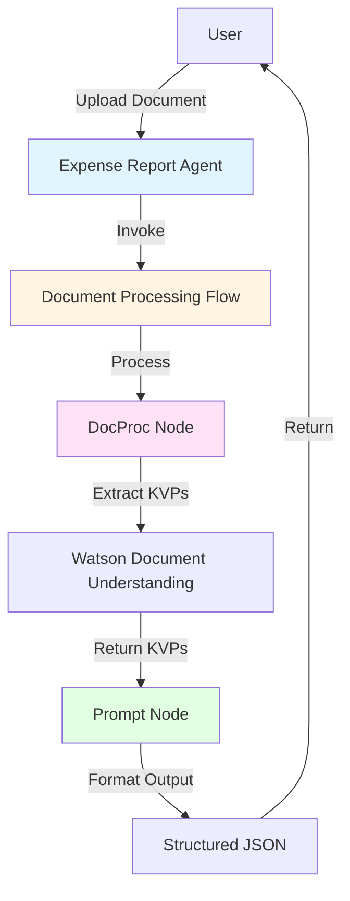
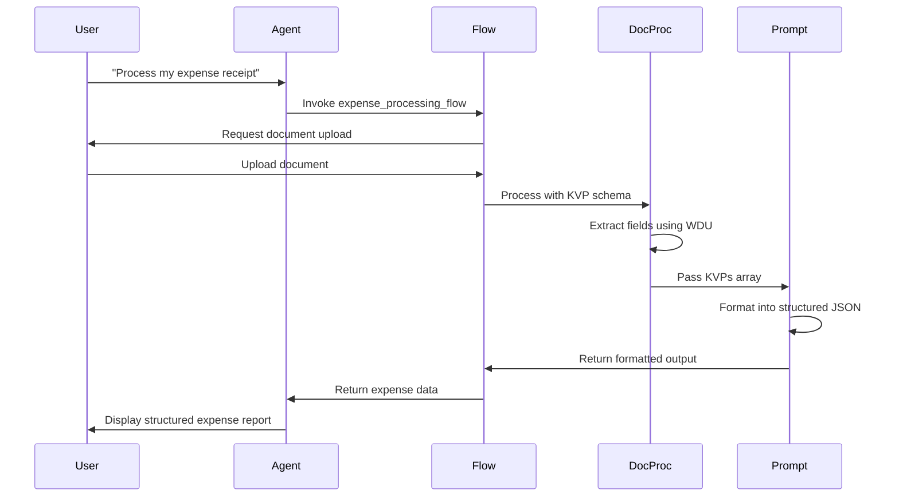

# Expense Report Agent

A watsonx Orchestrate agent that processes expense documents (airline tickets, hotel invoices, and general receipts) and extracts structured expense data using Watson Document Understanding with KVP (Key-Value Pair) extraction.

## Overview

This agent automates expense report creation by:
1. Accepting uploaded expense documents
2. Extracting key expense fields using Watson Document Understanding
3. Returning structured JSON output with all expense details

## Architecture



## Workflow Sequence



## Project Structure

```
expense_report_agent/
├── tools/
│   └── expense_processing_flow.py    # Document processing flow with inline KVP schema
├── agents/
│   └── expense_report_agent.yaml     # Native agent configuration
├── main.py                            # Testing script
├── import-all.sh                      # Deployment script
└── README.md                          # This file
```

## Extracted Fields

### Invoice Information
- **Invoice Date**: Date of the invoice/receipt
- **Transaction Mode**: Payment method (Credit Card, Bank Transfer, Cash, etc.)

### Airline Information (if applicable)
- **Airline Name**: Name of the airline
- **Passenger Name**: Name of the passenger
- **Ticket Number**: Airline ticket number
- **Ticket Date**: Date of ticket issuance
- **Flight Details**: Flight number, route, departure/arrival times

### Hotel Information (if applicable)
- **Hotel Name**: Name of the hotel
- **Customer Name**: Name of the guest
- **City**: City where hotel is located

### Fee Information
- **Base Fare**: Base charges/fare amount before taxes
- **Taxes**: Tax amount with breakdown if available
- **Total Amount**: Total amount due including all charges
- **Currency**: Currency code (USD, EUR, etc.)

## Features

- ✅ **Native Agent**: Uses `groq/openai/gpt-oss-120b` LLM for better document handling
- ✅ **Comprehensive KVP Schema**: Single schema handles all expense types
- ✅ **JSON Output**: Returns structured data directly (not file reference)
- ✅ **Handwritten Support**: Processes both printed and handwritten documents
- ✅ **Intelligent Formatting**: LLM-powered prompt node formats KVP data
- ✅ **Auto-Processing**: No manual review required (includes confidence scores)

## Installation

### Prerequisites

- watsonx Orchestrate Developer Edition installed
- Docker engine with minimum 20GB RAM allocation
- watsonx Orchestrate CLI (`orchestrate`) installed
- Python 3.8+ with watsonx Orchestrate SDK

### Setup

1. **Enable Document Processing**:
   ```bash
   orchestrate server start -e .env -d
   ```

2. **Install Dependencies**:
   ```bash
   pip install ibm-watsonx-orchestrate
   ```

3. **Deploy the Agent**:
   ```bash
   ./import-all.sh
   ```

   Or manually:
   ```bash
   orchestrate flow import tools/expense_processing_flow.py
   orchestrate agent import agents/expense_report_agent.yaml
   ```

## Usage

### Via Chat UI

1. Open watsonx Orchestrate chat interface
2. Select "Expense Report Agent"
3. Say: "Process my expense document"
4. Upload your document when prompted
5. Review the extracted expense data

### Programmatically

```python
import asyncio
from ibm_watsonx_orchestrate import APIClient

async def process_expense():
    client = APIClient()
    
    # Import flow
    flow_result = await client.import_flow(build_expense_processing_flow)
    
    # Process document (requires document reference)
    result = await client.invoke_flow(
        flow_id=flow_result['id'],
        input_data={
            "document_ref": "your_document_reference"
        }
    )
    
    print(result)

asyncio.run(process_expense())
```

### Testing Locally

```bash
python main.py
```

## Output Format

The agent returns a structured JSON object:

```json
{
  "summary": "Airline ticket for John Smith on United Airlines flight UA123...",
  "invoice_date": "2024-01-15",
  "transaction_mode": "Credit Card",
  "airline_name": "United Airlines",
  "passenger_name": "John Smith",
  "ticket_number": "0162345678901",
  "ticket_date": "2024-01-10",
  "flight_details": "UA123, SFO to JFK, Dep: 08:00, Arr: 16:30",
  "hotel_name": "",
  "customer_name": "",
  "city": "",
  "base_fare": "$450.00",
  "taxes": "$67.50",
  "total_amount": "$517.50",
  "currency": "USD"
}
```

## Supported Document Types

1. **Airline Tickets**
   - Extracts passenger, flight, and fare details
   - Supports multiple airlines
   - Handles both e-tickets and printed tickets

2. **Hotel Invoices**
   - Extracts hotel, guest, and billing information
   - Supports various hotel chains
   - Processes itemized charges

3. **General Receipts**
   - Extracts vendor, date, and payment details
   - Handles restaurant, taxi, and other receipts
   - Supports various receipt formats

## Technical Details

### KVP Schema

The flow uses a comprehensive `DocProcKVPSchema` with 14 fields defined using `DocProcField`:
- Each field includes description, example, and default value
- Schema is defined inline in the flow file
- Single schema handles all document types

### Document Processing

- **Node Type**: `docproc` with `text_extraction` task
- **Output Format**: `DocProcOutputFormat.object` (inline JSON)
- **Features**: Document structure analysis, handwritten text support
- **Model**: Default Watson Document Understanding model

### Formatting

- **Prompt Node**: Intelligently formats KVP array into structured output
- **System Prompt**: Defines assistant role for data formatting
- **Output Schema**: Pydantic model with all expense fields

## Best Practices

1. **Document Quality**: Use clear, high-resolution scans for best results
2. **File Formats**: Supports PDF, PNG, JPG, and other common formats
3. **File Size**: Keep documents under 10MB for optimal processing
4. **Multiple Pages**: Multi-page documents are supported
5. **Handwritten**: Works with handwritten receipts (enable_hw=True)

## Troubleshooting

### Common Issues

**Issue**: Flow import fails
- **Solution**: Ensure watsonx Orchestrate server is running with document processing enabled

**Issue**: Low extraction accuracy
- **Solution**: Use higher quality document scans, ensure text is clearly visible

**Issue**: Missing fields in output
- **Solution**: Optional fields return empty strings if not found in document

**Issue**: Agent doesn't invoke flow
- **Solution**: Verify agent configuration includes `expense_processing_flow` in tools list

## Development

### Modifying the KVP Schema

Edit the `EXPENSE_KVP_SCHEMA` in `tools/expense_processing_flow.py`:

```python
EXPENSE_KVP_SCHEMA = DocProcKVPSchema(
    document_type="Expense Document",
    fields={
        "new_field": DocProcField(
            description="Description of new field",
            default="",
            example="Example value",
        ),
        # ... other fields
    }
)
```

### Adding New Fields to Output

1. Update `ExpenseReportOutput` class
2. Add corresponding `map_output` in the flow
3. Update prompt node instructions if needed

### Testing Changes

```bash
# Test flow locally
python main.py

# Deploy changes
./import-all.sh
```

## Resources

- [watsonx Orchestrate Documentation](https://developer.watson-orchestrate.ibm.com/)
- [Document Processing Nodes](https://developer.watson-orchestrate.ibm.com/tools/flows/document_processing_nodes)
- [KVP Extraction Guide](https://developer.watson-orchestrate.ibm.com/tools/flows/document_processing_nodes#semantic-key-value-pair-kvp-extraction)
- [Agent Configuration](https://developer.watson-orchestrate.ibm.com/agents/build_agent)

## License

This project is part of the watsonx Orchestrate ADK examples.

## Support

For issues or questions:
1. Check the [watsonx Orchestrate documentation](https://developer.watson-orchestrate.ibm.com/)
2. Review the implementation guide in `wxo-implementation-guide.md`
3. Consult the detailed plan in `expense-report-agent-plan.md`