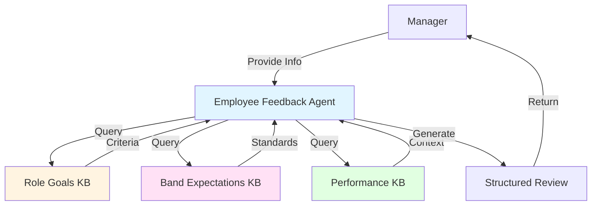

# Employee Feedback Agent

A watsonx Orchestrate agent that generates comprehensive, structured performance reviews for Brand Technical Specialists (BTS) and Client Success Managers (CSM) using organizational role goals and band expectations as evaluation criteria.

## Overview

This agent automates performance review creation by:
1. Collecting employee information and performance data from managers
2. Querying organizational knowledge bases for role-specific criteria and band expectations
3. Analyzing performance against established standards
4. Generating structured, comprehensive performance reviews with ratings and recommendations

## Architecture



## Project Structure

```
employee-feedback-agent/
├── agents/
│   ├── employee_feedback_agent.yaml     # Native agent configuration
│   └── AskOrchestrate.yaml             # Orchestration agent
├── knowledge-bases/
│   ├── role-goals-kb.yaml              # Role-specific evaluation criteria
│   ├── band-expectations-kb.yaml       # Band-level competencies
│   ├── employee-performance-kb.yaml    # Performance tracking
│   ├── role-goals.pdf                  # Role goals documentation
│   ├── BTS band-expectations.pdf       # BTS band expectations
│   ├── CSM band-expectations.pdf       # CSM band expectations
│   └── upload-guide.md                 # KB upload instructions
├── employee-feedback-agent-plan.md     # Detailed implementation plan
├── employee-feedback-agent-README.md   # Agent-specific documentation
├── employee-feedback-agent-workflow.md # Workflow documentation
├── employee-self-assessment-template.md # Self-assessment template
├── employee-self-feedback-quarterly.md  # Quarterly review template
├── employee-self-feedback-yearly.md     # Annual review template
├── AGENT-CREATION-PROMPT-EXAMPLE.md    # Prompt engineering guide
├── import-employee-feedback-agent.sh   # Deployment script
└── README.md                           # This file
```

## Features

- ✅ **Multi-Role Support**: Handles BTS and CSM roles with role-specific criteria
- ✅ **Band-Aware**: Evaluates against band 6-10 expectations
- ✅ **Knowledge Base Integration**: Uses organizational standards and criteria
- ✅ **Structured Output**: Consistent, comprehensive review format
- ✅ **Progress Tracking**: Compares with previous reviews when available
- ✅ **Development Focus**: Provides actionable recommendations
- ✅ **Band Progression**: Assesses readiness for advancement

## Review Components

### Generated Review Includes:

1. **Overall Rating** (1-5 scale with description)
2. **Category Ratings** (role-specific competencies)
3. **Performance Summary** (narrative overview)
4. **Strengths** (3-5 specific examples)
5. **Areas for Improvement** (constructive feedback)
6. **Progress Tracking** (vs. previous review)
7. **Development Recommendations** (training, assignments)
8. **Band Progression Assessment** (readiness for advancement)
9. **Action Items** (specific, measurable goals)
10. **Manager Notes** (additional context)

## Installation

### Prerequisites

- watsonx Orchestrate Developer Edition installed
- watsonx Orchestrate CLI (`orchestrate`) installed
- Python 3.8+ with watsonx Orchestrate SDK

### Setup

1. **Start watsonx Orchestrate**:
   ```bash
   orchestrate server start -e .env -d
   ```

2. **Upload Knowledge Bases**:
   ```bash
   # Upload role goals
   orchestrate kb upload knowledge-bases/role-goals.pdf --kb-id role-goals-kb
   
   # Upload band expectations
   orchestrate kb upload knowledge-bases/BTS\ band-expectations.pdf --kb-id band-expectations-kb
   orchestrate kb upload knowledge-bases/CSM\ band-expectations.pdf --kb-id band-expectations-kb
   ```

3. **Deploy the Agent**:
   ```bash
   ./import-employee-feedback-agent.sh
   ```

   Or manually:
   ```bash
   orchestrate kb import knowledge-bases/role-goals-kb.yaml
   orchestrate kb import knowledge-bases/band-expectations-kb.yaml
   orchestrate kb import knowledge-bases/employee-performance-kb.yaml
   orchestrate agent import agents/employee_feedback_agent.yaml
   ```

## Usage

### Via Chat UI

1. Open watsonx Orchestrate chat interface
2. Select "Employee Feedback Agent"
3. Provide employee information when prompted:
   - Full name
   - Role (BTS or CSM)
   - Current salary band (6-10)
   - Review period
   - Performance details
4. Review the generated performance review

### Example Interaction

```
Manager: "I need to create a performance review for Sarah Johnson"

Agent: "I'll help you create a comprehensive performance review. Let me gather some information:

1. What is Sarah's role? (BTS or CSM)
2. What is her current salary band? (6-10)
3. What review period is this for? (e.g., Q1 2026, FY 2025)
4. Is this a quarterly or annual review?

Please also share:
- Key accomplishments and achievements
- Challenges faced and how they were handled
- Client feedback
- Goals achieved vs. goals set
- Areas of growth
- Team collaboration examples"

Manager: [Provides information]

Agent: [Queries knowledge bases and generates structured review]
```

## Output Format

The agent generates a comprehensive markdown document with:

```markdown
# Performance Review: [Employee Name]

**Role:** [BTS/CSM]  
**Band:** [6-10]  
**Review Period:** [Period]  
**Review Date:** [Date]  
**Reviewer:** [Manager Name]

## Overall Rating: [1-5]
[Rating description and justification]

## Category Ratings
[Role-specific competency ratings with notes]

## Performance Summary
[2-3 paragraph narrative overview]

## Strengths
- [Specific strength with example]
- [Specific strength with example]
...

## Areas for Improvement
- [Constructive feedback with suggestions]
- [Constructive feedback with suggestions]
...

## Progress Tracking
[Comparison with previous review if available]

## Development Recommendations
- [Specific development item]
- [Specific development item]
...

## Band Progression Assessment
[Readiness for advancement analysis]

## Action Items
- [Specific, measurable action with timeline]
- [Specific, measurable action with timeline]
...

## Manager Notes
[Additional confidential observations]
```

## Supported Roles

### Brand Technical Specialist (BTS)
Evaluation categories:
1. Technical Excellence
2. Brand Knowledge and Advocacy
3. Client Relationship Management
4. Innovation and Problem-Solving
5. Collaboration and Knowledge Sharing
6. Band-Level Competencies

### Client Success Manager (CSM)
Evaluation categories:
1. Client Relationship Excellence
2. Revenue Growth and Account Expansion
3. Client Advocacy and Success
4. Proactive Account Management
5. Strategic Planning and Execution
6. Band-Level Competencies

## Knowledge Base Content

### Role Goals KB
- Role-specific evaluation criteria
- KPIs and success metrics
- Cross-role competencies
- Rating scales and guidelines

### Band Expectations KB
- Band 6-10 competencies
- Skills and behaviors by level
- Progression requirements
- Leadership expectations

### Employee Performance KB
- Historical performance data
- Previous reviews
- Goal tracking
- Development progress

## Best Practices

1. **Provide Specific Examples**: Include concrete achievements and situations
2. **Be Objective**: Base feedback on observable behaviors and results
3. **Balance Feedback**: Include both strengths and areas for improvement
4. **Reference Standards**: Agent will align feedback with organizational criteria
5. **Track Progress**: Provide previous review for comparison when available
6. **Focus on Development**: Emphasize growth opportunities

## Troubleshooting

### Common Issues

**Issue**: Agent doesn't query knowledge bases
- **Solution**: Verify knowledge bases are uploaded and configured correctly

**Issue**: Generic feedback not aligned with role
- **Solution**: Ensure role and band are specified correctly

**Issue**: Missing category ratings
- **Solution**: Provide sufficient performance information for each competency area

**Issue**: No band progression assessment
- **Solution**: Verify band expectations KB includes next band criteria

## Development

### Customizing the Agent

1. **Modify Evaluation Criteria**: Update role-goals-kb.yaml
2. **Adjust Band Expectations**: Update band-expectations-kb.yaml
3. **Change Output Format**: Modify agent instructions in employee_feedback_agent.yaml
4. **Add New Roles**: Extend agent configuration and knowledge bases

### Testing Changes

```bash
# Test agent locally
orchestrate agent test employee_feedback_agent

# Deploy changes
./import-employee-feedback-agent.sh
```

## Documentation

- [Detailed Implementation Plan](employee-feedback-agent-plan.md)
- [Agent Workflow](employee-feedback-agent-workflow.md)
- [Prompt Engineering Guide](AGENT-CREATION-PROMPT-EXAMPLE.md)
- [Self-Assessment Templates](employee-self-assessment-template.md)
- [Quarterly Review Template](employee-self-feedback-quarterly.md)
- [Annual Review Template](employee-self-feedback-yearly.md)

## Resources

- [watsonx Orchestrate Documentation](https://developer.watson-orchestrate.ibm.com/)
- [Agent Configuration Guide](https://developer.watson-orchestrate.ibm.com/agents/build_agent)
- [Knowledge Base Setup](https://developer.watson-orchestrate.ibm.com/knowledge-bases)

## License

This project is part of the watsonx Orchestrate agent examples.

## Support

For issues or questions:
1. Check the [watsonx Orchestrate documentation](https://developer.watson-orchestrate.ibm.com/)
2. Review the implementation guide in `employee-feedback-agent-plan.md`
3. Consult the prompt engineering guide in `AGENT-CREATION-PROMPT-EXAMPLE.md`