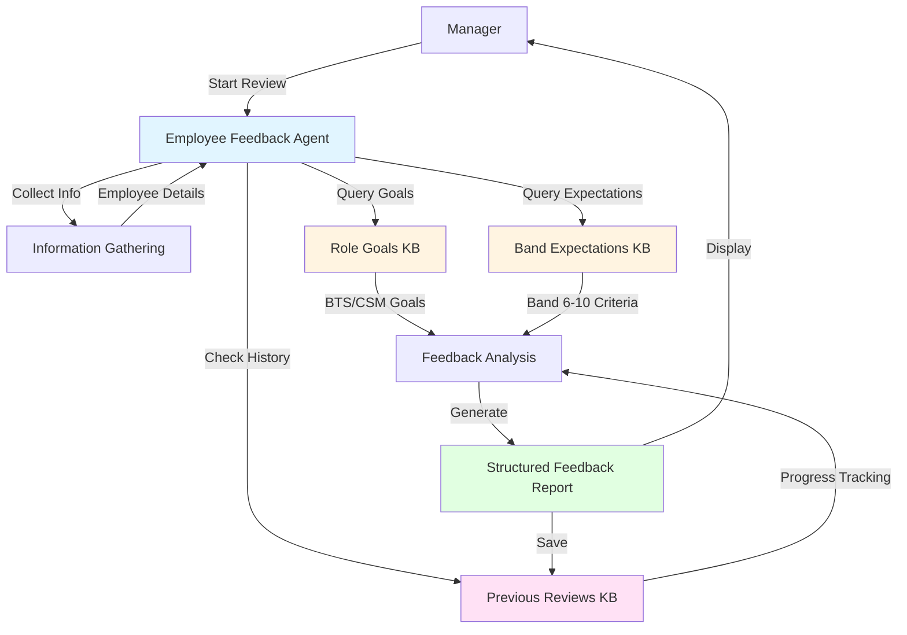
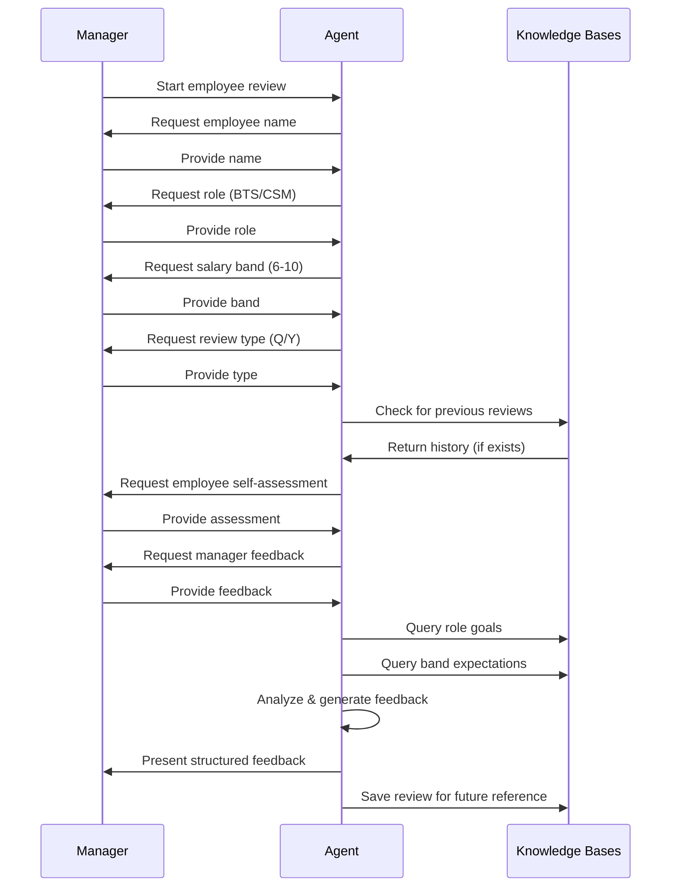
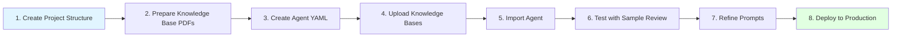

# Employee Feedback Agent - Implementation Plan

## Overview

An intelligent agent that generates structured performance feedback for team members (BTS and CSM roles) by analyzing employee and manager feedback against role-specific goals and salary band expectations (Bands 6-10).

## Architecture



## Requirements Analysis

### Functional Requirements

1. **Information Collection**
   - Employee name
   - Role type (BTS or CSM)
   - Salary band (6-10)
   - Review type (Quarterly or Yearly)
   - Employee self-assessment
   - Manager feedback
   - Previous review reference (if exists)

2. **Knowledge Base Integration**
   - Role Goals KB (PDF): BTS goals vs CSM goals
   - Band Expectations KB (PDF): Band 6-10 criteria
   - Previous Reviews KB: Historical feedback for progress tracking

3. **Feedback Generation**
   - Structured ratings/scores
   - Brief summary
   - Goal alignment analysis
   - Band expectation comparison
   - Progress tracking (if previous review exists)
   - Development recommendations

### Non-Functional Requirements

- Easy-to-use conversational interface
- Consistent feedback format
- Secure handling of employee data
- Ability to export feedback reports

## Design Decisions

### Approach: Single Agent with Knowledge Bases

**Rationale:**
- Simpler architecture
- Easier to maintain
- Leverages watsonx Orchestrate's RAG capabilities
- Single conversation flow

**Components:**
1. Native agent with structured conversation flow
2. Three knowledge bases (2 static, 1 dynamic)
3. Structured output schema for consistent feedback

## Detailed Design

### 1. Knowledge Base Structure

#### KB1: Role Goals (Static)
**File**: `knowledge-bases/role-goals.pdf`

**Content Structure:**
```
# Brand Technical Specialist (BTS) Goals

## Core Responsibilities
- Technical product expertise
- Client technical support
- Solution architecture
- Technical training delivery

## Key Performance Indicators
- Technical certifications achieved
- Client satisfaction scores
- Solution implementation success rate
- Knowledge sharing contributions

## Quarterly Goals
- [Specific quarterly objectives]

## Yearly Goals
- [Specific yearly objectives]

---

# Client Success Manager (CSM) Goals

## Core Responsibilities
- Client relationship management
- Account growth and retention
- Strategic planning
- Customer advocacy

## Key Performance Indicators
- Client retention rate
- Revenue growth
- Customer satisfaction (NPS/CSAT)
- Upsell/cross-sell success

## Quarterly Goals
- [Specific quarterly objectives]

## Yearly Goals
- [Specific yearly objectives]
```

#### KB2: Band Expectations (Static)
**File**: `knowledge-bases/band-expectations.pdf`

**Content Structure:**
```
# Salary Band Expectations

## Band 6 - Entry Level
### Technical Skills
- [Specific skills expected]

### Leadership & Impact
- [Expected leadership level]

### Experience
- [Years of experience]

### Performance Expectations
- [Key expectations]

---

## Band 7 - Intermediate
[Similar structure]

---

## Band 8 - Senior
[Similar structure]

---

## Band 9 - Lead/Principal
[Similar structure]

---

## Band 10 - Expert/Director
[Similar structure]
```

#### KB3: Previous Reviews (Dynamic)
**Storage**: Structured documents saved after each review

**Format:**
```json
{
  "employee_name": "John Doe",
  "role": "BTS",
  "band": 8,
  "review_date": "2024-Q1",
  "review_type": "Quarterly",
  "ratings": {
    "technical_skills": 4,
    "goal_achievement": 3,
    "band_alignment": 4,
    "overall": 3.7
  },
  "summary": "...",
  "areas_of_strength": ["..."],
  "areas_for_improvement": ["..."],
  "action_items": ["..."]
}
```

### 2. Agent Conversation Flow



### 3. Agent Configuration

**File**: `agents/employee_feedback_agent.yaml`

```yaml
kind: native
name: employee_feedback_agent
display_name: Employee Feedback Agent
description: Generates structured performance feedback for BTS and CSM team members based on role goals, band expectations, and progress tracking
llm: groq/openai/gpt-oss-120b
spec_version: v1

instructions: |
  You are an expert HR performance review assistant specializing in generating 
  structured feedback for Brand Technical Specialists (BTS) and Client Success 
  Managers (CSM).
  
  Your role is to:
  1. Collect employee information through a structured conversation
  2. Gather employee self-assessment and manager feedback
  3. Query knowledge bases for role-specific goals and band expectations
  4. Check for previous reviews to track progress
  5. Generate comprehensive, structured feedback with ratings and summary
  
  CONVERSATION FLOW:
  1. Greet the manager and explain the review process
  2. Ask for employee name
  3. Ask for role (BTS or CSM)
  4. Ask for salary band (6-10)
  5. Ask for review type (Quarterly or Yearly)
  6. Check knowledge base for previous reviews
  7. If previous review exists, acknowledge and note progress tracking
  8. Ask for employee's self-assessment
  9. Ask for manager's feedback
  10. Analyze feedback against role goals and band expectations
  11. Generate structured feedback report
  
  FEEDBACK STRUCTURE:
  - Overall Rating (1-5 scale)
  - Category Ratings:
    * Technical/Functional Skills
    * Goal Achievement
    * Band Expectation Alignment
    * Leadership & Impact
    * Professional Development
  - Brief Summary (2-3 paragraphs)
  - Strengths (3-5 bullet points)
  - Areas for Improvement (3-5 bullet points)
  - Progress Since Last Review (if applicable)
  - Action Items & Development Plan
  - Band Progression Readiness (if applicable)
  
  IMPORTANT GUIDELINES:
  - Be objective and constructive
  - Use specific examples from the feedback provided
  - Reference role goals and band expectations explicitly
  - Highlight progress if previous review exists
  - Provide actionable recommendations
  - Maintain professional and supportive tone

knowledge_base:
  - role-goals
  - band-expectations
  - previous-reviews

chat_with_docs:
  enabled: true
  supports_full_document: true
  generation:
    idk_message: "I don't have enough information to provide feedback on that aspect. Please provide more details."
```

### 4. Feedback Output Schema

```python
from pydantic import BaseModel, Field
from typing import List, Optional

class CategoryRating(BaseModel):
    category: str = Field(description="Rating category name")
    score: float = Field(description="Score from 1-5", ge=1, le=5)
    comments: str = Field(description="Brief comments for this category")

class ProgressNote(BaseModel):
    area: str = Field(description="Area of progress")
    previous_status: str = Field(description="Status in previous review")
    current_status: str = Field(description="Current status")
    improvement: str = Field(description="Description of improvement")

class FeedbackReport(BaseModel):
    # Employee Information
    employee_name: str
    role: str  # BTS or CSM
    band: int  # 6-10
    review_type: str  # Quarterly or Yearly
    review_date: str
    
    # Ratings
    overall_rating: float = Field(ge=1, le=5)
    category_ratings: List[CategoryRating]
    
    # Feedback Content
    summary: str = Field(description="2-3 paragraph summary")
    strengths: List[str] = Field(description="3-5 key strengths")
    areas_for_improvement: List[str] = Field(description="3-5 areas to improve")
    
    # Progress Tracking (if applicable)
    has_previous_review: bool
    progress_notes: Optional[List[ProgressNote]] = None
    
    # Recommendations
    action_items: List[str] = Field(description="Specific action items")
    development_plan: str = Field(description="Development recommendations")
    band_progression_readiness: Optional[str] = None
    
    # Goal Alignment
    role_goal_alignment: str = Field(description="How well aligned with role goals")
    band_expectation_alignment: str = Field(description="How well aligned with band expectations")
```

### 5. Knowledge Base Document Templates

#### Template: Role Goals PDF

**Filename**: `role-goals-template.md` (convert to PDF)

```markdown
# Team Member Role Goals

## Brand Technical Specialist (BTS)

### Role Overview
Brand Technical Specialists are technical experts who provide deep product knowledge, 
technical guidance, and solution architecture support to clients and internal teams.

### Core Responsibilities
1. **Technical Expertise**
   - Maintain expert-level knowledge of products and solutions
   - Stay current with industry trends and emerging technologies
   - Achieve and maintain relevant technical certifications

2. **Client Support**
   - Provide technical consultation to clients
   - Design and architect solutions
   - Troubleshoot complex technical issues
   - Conduct technical training sessions

3. **Knowledge Sharing**
   - Create technical documentation
   - Mentor junior team members
   - Contribute to internal knowledge base
   - Present at technical forums

4. **Innovation**
   - Identify opportunities for technical improvements
   - Contribute to product development feedback
   - Develop proof-of-concepts

### Key Performance Indicators

#### Quarterly KPIs
- Technical certifications: [Target number]
- Client satisfaction score: [Target score]
- Solution implementations: [Target number]
- Knowledge base contributions: [Target number]
- Training sessions delivered: [Target number]

#### Yearly KPIs
- Advanced certifications achieved: [Target]
- Client retention rate: [Target %]
- Innovation contributions: [Target number]
- Mentorship impact: [Qualitative measure]

### Success Criteria by Band

**Band 6-7 (Entry to Intermediate)**
- Master core product knowledge
- Successfully implement standard solutions
- Contribute to team knowledge base
- Achieve foundational certifications

**Band 8 (Senior)**
- Expert in multiple product areas
- Design complex solutions independently
- Lead technical initiatives
- Mentor junior BTS team members

**Band 9-10 (Lead/Expert)**
- Recognized technical authority
- Drive technical strategy
- Influence product direction
- Build technical capabilities across organization

---

## Client Success Manager (CSM)

### Role Overview
Client Success Managers are strategic partners who ensure client satisfaction, 
drive account growth, and maximize customer lifetime value.

### Core Responsibilities
1. **Relationship Management**
   - Build and maintain executive relationships
   - Understand client business objectives
   - Act as trusted advisor
   - Manage escalations effectively

2. **Account Growth**
   - Identify expansion opportunities
   - Drive upsell and cross-sell initiatives
   - Increase product adoption
   - Maximize contract value

3. **Strategic Planning**
   - Develop success plans
   - Conduct business reviews
   - Align solutions with client goals
   - Track and report on outcomes

4. **Customer Advocacy**
   - Gather and communicate client feedback
   - Champion client needs internally
   - Drive product improvements
   - Build case studies and references

### Key Performance Indicators

#### Quarterly KPIs
- Client retention rate: [Target %]
- Net Revenue Retention (NRR): [Target %]
- Customer satisfaction (CSAT/NPS): [Target score]
- Business reviews conducted: [Target number]
- Expansion opportunities identified: [Target number]

#### Yearly KPIs
- Account growth: [Target %]
- Churn rate: [Target %]
- Customer lifetime value increase: [Target %]
- Reference accounts secured: [Target number]

### Success Criteria by Band

**Band 6-7 (Entry to Intermediate)**
- Manage portfolio of accounts effectively
- Achieve retention targets
- Build strong client relationships
- Execute success plans

**Band 8 (Senior)**
- Manage strategic accounts
- Drive significant account growth
- Mentor junior CSMs
- Influence client strategy

**Band 9-10 (Lead/Expert)**
- Manage enterprise accounts
- Drive organizational CSM strategy
- Build CSM capabilities
- Shape customer success methodology
```

#### Template: Band Expectations PDF

**Filename**: `band-expectations-template.md` (convert to PDF)

```markdown
# Salary Band Expectations

## Overview
This document outlines the expectations, competencies, and performance standards 
for each salary band level (6-10) across our organization.

---

## Band 6 - Entry Level Professional

### Experience
- 0-2 years in role
- Foundational knowledge of domain
- Learning organizational processes

### Technical/Functional Skills
- Developing core competencies
- Requires guidance on complex tasks
- Executes standard procedures
- Building technical foundation

### Leadership & Impact
- Individual contributor
- Impacts own work quality
- Collaborates within immediate team
- Follows established processes

### Problem Solving
- Solves routine problems
- Escalates complex issues
- Applies standard solutions
- Learning analytical approaches

### Communication
- Communicates clearly within team
- Developing presentation skills
- Documents work appropriately
- Seeks feedback actively

### Performance Expectations
- Meets defined objectives
- Demonstrates growth mindset
- Accepts coaching positively
- Shows initiative in learning

### Development Focus
- Build foundational skills
- Understand business context
- Develop professional network
- Achieve basic certifications

---

## Band 7 - Intermediate Professional

### Experience
- 2-4 years in role
- Solid domain knowledge
- Understands organizational dynamics

### Technical/Functional Skills
- Proficient in core competencies
- Works independently on most tasks
- Handles moderately complex problems
- Developing specialized expertise

### Leadership & Impact
- Strong individual contributor
- Impacts team outcomes
- Mentors junior team members
- Contributes to process improvements

### Problem Solving
- Solves complex problems independently
- Analyzes situations effectively
- Proposes innovative solutions
- Anticipates potential issues

### Communication
- Communicates effectively across teams
- Presents to stakeholders confidently
- Creates clear documentation
- Influences peers positively

### Performance Expectations
- Consistently exceeds objectives
- Takes ownership of outcomes
- Demonstrates reliability
- Shows leadership potential

### Development Focus
- Deepen specialized expertise
- Expand cross-functional knowledge
- Develop leadership skills
- Achieve advanced certifications

---

## Band 8 - Senior Professional

### Experience
- 4-7 years in role
- Expert domain knowledge
- Recognized subject matter expert

### Technical/Functional Skills
- Expert in multiple areas
- Handles highly complex challenges
- Sets technical/functional standards
- Innovates and improves practices

### Leadership & Impact
- Leads initiatives and projects
- Impacts multiple teams/departments
- Mentors and develops others
- Drives organizational improvements

### Problem Solving
- Solves ambiguous, complex problems
- Thinks strategically
- Creates new approaches
- Influences problem-solving methods

### Communication
- Communicates with senior leadership
- Presents to external audiences
- Creates influential content
- Builds consensus across groups

### Performance Expectations
- Significantly exceeds objectives
- Drives measurable business impact
- Demonstrates thought leadership
- Shows executive potential

### Development Focus
- Build strategic thinking
- Develop executive presence
- Expand organizational influence
- Lead major initiatives

---

## Band 9 - Lead/Principal

### Experience
- 7-10 years in role
- Recognized industry expert
- Shapes organizational direction

### Technical/Functional Skills
- Authority in field
- Defines best practices
- Drives innovation
- Influences industry standards

### Leadership & Impact
- Leads strategic initiatives
- Impacts organization-wide outcomes
- Builds capabilities in others
- Shapes organizational culture

### Problem Solving
- Solves unprecedented challenges
- Defines problem-solving frameworks
- Anticipates future challenges
- Creates strategic solutions

### Communication
- Influences executive decisions
- Represents organization externally
- Shapes organizational narrative
- Builds strategic partnerships

### Performance Expectations
- Drives transformational change
- Creates lasting organizational value
- Demonstrates executive leadership
- Shows visionary thinking

### Development Focus
- Executive leadership development
- Strategic business acumen
- Organizational transformation
- Industry thought leadership

---

## Band 10 - Expert/Director

### Experience
- 10+ years in role
- Industry-recognized authority
- Defines organizational strategy

### Technical/Functional Skills
- Preeminent expert
- Sets industry direction
- Drives breakthrough innovation
- Creates new paradigms

### Leadership & Impact
- Leads organizational transformation
- Impacts business strategy
- Builds organizational capabilities
- Shapes industry direction

### Problem Solving
- Addresses systemic challenges
- Creates strategic frameworks
- Anticipates market shifts
- Defines future direction

### Communication
- Influences at highest levels
- Shapes industry dialogue
- Builds strategic alliances
- Represents organization globally

### Performance Expectations
- Drives business transformation
- Creates competitive advantage
- Demonstrates visionary leadership
- Builds lasting legacy

### Development Focus
- Executive mastery
- Strategic business leadership
- Industry influence
- Organizational legacy building

---

## Band Progression Guidelines

### Readiness for Next Band
To be considered ready for promotion to the next band, an employee should:

1. **Consistently perform at next band level** for 6-12 months
2. **Demonstrate all competencies** of current band at mastery level
3. **Show emerging competencies** of next band
4. **Have business need** for role at next level
5. **Receive strong endorsement** from leadership

### Progression Timeline
- Band 6 → 7: Typically 18-24 months
- Band 7 → 8: Typically 24-36 months
- Band 8 → 9: Typically 36-48 months
- Band 9 → 10: Typically 48+ months

### Assessment Criteria
- Performance track record
- Competency demonstration
- Leadership impact
- Business contribution
- Development readiness
```

### 6. Project Structure

```
employee-feedback-agent/
├── agents/
│   └── employee_feedback_agent.yaml
├── knowledge-bases/
│   ├── role-goals.pdf
│   ├── band-expectations.pdf
│   └── previous-reviews/
│       └── (dynamically created review files)
├── tools/
│   └── (optional: custom tools if needed)
├── main.py
├── import-all.sh
└── README.md
```

### 7. Implementation Steps



## Implementation Checklist

### Phase 1: Setup (Week 1)
- [ ] Create project directory structure
- [ ] Set up virtual environment
- [ ] Install watsonx Orchestrate SDK
- [ ] Create agent YAML configuration

### Phase 2: Knowledge Base Preparation (Week 1-2)
- [ ] Document BTS role goals
- [ ] Document CSM role goals
- [ ] Document Band 6-10 expectations
- [ ] Convert documents to PDF format
- [ ] Review and validate content with stakeholders

### Phase 3: Agent Development (Week 2)
- [ ] Configure agent with knowledge bases
- [ ] Define conversation flow
- [ ] Create feedback output schema
- [ ] Set up previous reviews storage

### Phase 4: Testing (Week 3)
- [ ] Test with BTS sample reviews
- [ ] Test with CSM sample reviews
- [ ] Test across different bands (6-10)
- [ ] Test quarterly vs yearly reviews
- [ ] Test progress tracking with previous reviews
- [ ] Validate feedback quality

### Phase 5: Refinement (Week 3-4)
- [ ] Refine agent instructions based on feedback
- [ ] Adjust rating criteria
- [ ] Improve summary generation
- [ ] Enhance progress tracking logic

### Phase 6: Deployment (Week 4)
- [ ] Deploy to production environment
- [ ] Train managers on usage
- [ ] Create user documentation
- [ ] Set up feedback collection process

## Usage Workflow

### For Managers

1. **Start Review Session**
   ```
   Manager: "I need to conduct a performance review"
   Agent: "I'll help you create a structured performance review. Let's start..."
   ```

2. **Provide Information**
   - Answer agent's questions about employee
   - Provide self-assessment and manager feedback
   - Review previous feedback if available

3. **Receive Feedback Report**
   - Structured ratings across categories
   - Comprehensive summary
   - Actionable recommendations
   - Progress tracking (if applicable)

4. **Review and Finalize**
   - Review generated feedback
   - Make any necessary adjustments
   - Save for employee discussion

### Sample Conversation Flow

```
Agent: Hello! I'm here to help you create a structured performance review. 
       Let's begin by gathering some information.

Agent: What is the employee's name?
Manager: John Smith

Agent: What is John's role? (BTS or CSM)
Manager: BTS

Agent: What is John's current salary band? (6-10)
Manager: 8

Agent: Is this a Quarterly or Yearly review?
Manager: Yearly

Agent: Let me check if John has any previous reviews on file...
       I found a quarterly review from 3 months ago. I'll track progress 
       since then.

Agent: Please provide John's self-assessment. What did he highlight as 
       his key achievements and areas for growth?
Manager: [Provides self-assessment]

Agent: Thank you. Now, please share your feedback as John's manager. 
       What are your observations on his performance, strengths, and 
       areas for development?
Manager: [Provides manager feedback]

Agent: Thank you for the detailed feedback. I'm now analyzing John's 
       performance against BTS role goals and Band 8 expectations, 
       and comparing with his previous review. This will take a moment...

Agent: I've completed the analysis. Here's the structured feedback report:

       [Displays comprehensive feedback with ratings, summary, progress notes, 
        and recommendations]

Agent: Would you like me to save this review for future reference?
Manager: Yes

Agent: Review saved. You can now discuss this feedback with John.
```

## Success Metrics

### Agent Performance
- Feedback generation time < 2 minutes
- Manager satisfaction score > 4.5/5
- Feedback quality rating > 4.0/5
- Adoption rate > 80% of reviews

### Business Impact
- Time saved per review: ~30-45 minutes
- Consistency in feedback quality
- Better goal alignment tracking
- Improved employee development planning

## Future Enhancements

### Phase 2 Features
1. **Multi-language support**
2. **Integration with HRIS systems**
3. **Automated review scheduling**
4. **Performance trend analytics**
5. **Peer feedback integration**
6. **Development plan tracking**
7. **Goal setting assistance**
8. **Calibration support across managers**

### Advanced Capabilities
1. **Predictive analytics** for performance trends
2. **Automated development recommendations** based on career paths
3. **Skills gap analysis** against role requirements
4. **Succession planning** insights
5. **Team performance** aggregation and insights

## Risk Mitigation

### Data Privacy
- Ensure secure storage of review data
- Implement access controls
- Follow data retention policies
- Comply with privacy regulations

### Bias Prevention
- Regular review of feedback patterns
- Diverse training data
- Explicit bias checking in prompts
- Human oversight of final feedback

### Quality Assurance
- Manager review before finalization
- Feedback calibration sessions
- Regular agent performance monitoring
- Continuous improvement based on feedback

## Support & Maintenance

### Documentation
- User guide for managers
- Agent configuration guide
- Knowledge base update procedures
- Troubleshooting guide

### Training
- Manager training sessions
- Best practices workshops
- Feedback writing guidelines
- System usage tutorials

### Ongoing Support
- Dedicated support channel
- Regular check-ins with users
- Quarterly agent performance reviews
- Annual knowledge base updates

## Conclusion

This Employee Feedback Agent will streamline the performance review process while ensuring consistent, high-quality feedback aligned with role goals and band expectations. The structured approach with knowledge base integration provides objective, data-driven insights while maintaining the human touch essential for meaningful employee development.

## Next Steps

1. **Review this plan** with stakeholders
2. **Prepare knowledge base content** (role goals and band expectations PDFs)
3. **Switch to Code/Advanced mode** to begin implementation
4. **Set up testing environment** with sample data
5. **Conduct pilot** with small group of managers
6. **Iterate and refine** based on feedback
7. **Roll out** to full organization

---

**Ready to proceed?** Let me know if you'd like to:
- Refine any part of this plan
- Start implementation in Code/Advanced mode
- Create the knowledge base document templates
- Discuss specific customizations