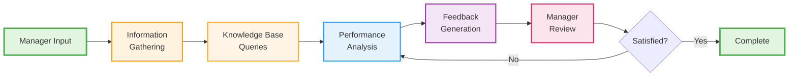
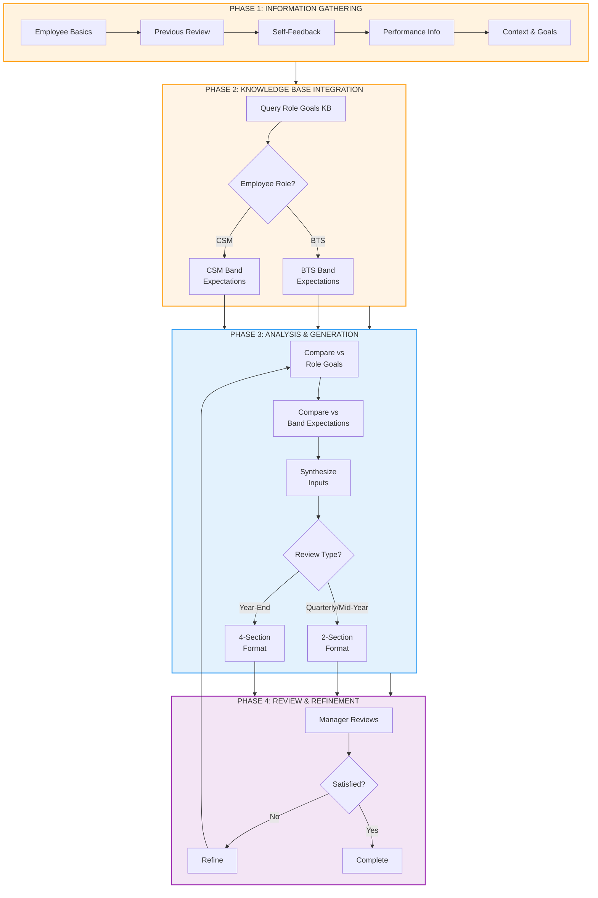
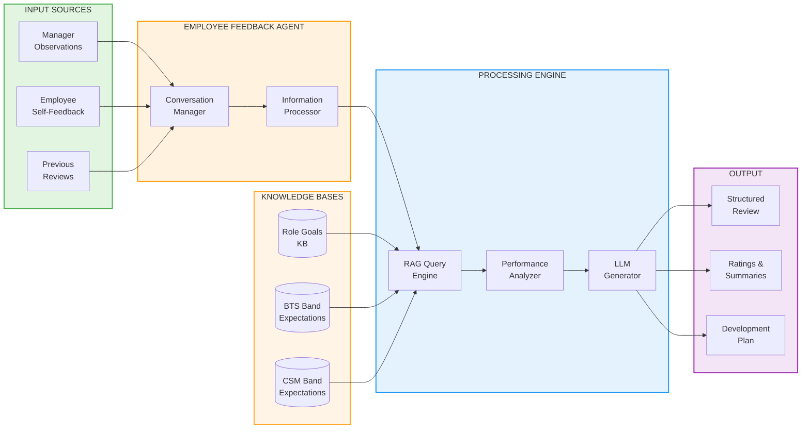

# Employee Feedback Agent - Workflow Diagrams

## Overview

This document contains multiple visual representations of the Employee Feedback Agent workflow, showing how the agent processes performance reviews from initial manager input through final review generation.

## How to View the Diagrams

The diagrams in this file use **Mermaid syntax** which renders as visual flowcharts in:
- ✅ GitHub (automatic rendering)
- ✅ GitLab (automatic rendering)
- ✅ VS Code (install "Markdown Preview Mermaid Support" extension)
- ✅ Online viewers: https://mermaid.live/

If you cannot see the rendered diagrams, see the **ASCII Text Workflow** section below for a text-based version.

---

## ASCII Text Workflow Diagram

```
┌─────────────────────────────────────────────────────────────────────────────┐
│                    EMPLOYEE FEEDBACK AGENT WORKFLOW                          │
└─────────────────────────────────────────────────────────────────────────────┘

┌─────────────────────────────────────────────────────────────────────────────┐
│ PHASE 1: INFORMATION GATHERING                                              │
└─────────────────────────────────────────────────────────────────────────────┘

    [Manager Initiates Review]
              ↓
    ┌─────────────────────┐
    │ Step 1: Employee    │
    │ Basics              │
    │ • Name              │
    │ • Role (BTS/CSM)    │
    │ • Band (6-10)       │
    │ • Review Period     │
    │ • Review Type       │
    └──────────┬──────────┘
              ↓
    ┌─────────────────────┐
    │ Step 2: Previous    │
    │ Review Check        │
    └──────────┬──────────┘
              ↓
         ┌────┴────┐
         │ Has     │
         │Previous?│
         └────┬────┘
         Yes  │  No
         ↓    ↓
    [Get Previous Review]
              ↓
    ┌─────────────────────┐
    │ Step 2.5: Employee  │
    │ Self-Feedback       │
    └──────────┬──────────┘
              ↓
         ┌────┴────┐
         │ Has     │
         │Self-FB? │
         └────┬────┘
         Yes  │  No
         ↓    ↓
    [Get Self-Feedback]
              ↓
    ┌─────────────────────┐
    │ Step 3: Performance │
    │ Information         │
    │ • Accomplishments   │
    │ • Challenges        │
    │ • Examples          │
    │ • Feedback          │
    │ • Manager Points    │
    └──────────┬──────────┘
              ↓
    ┌─────────────────────┐
    │ Step 4: Context &   │
    │ Goals               │
    │ • Period Goals      │
    │ • Circumstances     │
    │ • Aspirations       │
    │ • Training          │
    └──────────┬──────────┘
              ↓

┌─────────────────────────────────────────────────────────────────────────────┐
│ PHASE 2: KNOWLEDGE BASE INTEGRATION (RAG)                                   │
└─────────────────────────────────────────────────────────────────────────────┘

    ┌─────────────────────┐
    │ Query Role Goals KB │
    │ • Role Goals        │
    │ • KPIs              │
    │ • Success Criteria  │
    │ • Competencies      │
    └──────────┬──────────┘
              ↓
    ┌─────────────────────┐
    │ Query Band          │
    │ Expectations KB     │
    └──────────┬──────────┘
              ↓
         ┌────┴────┐
         │Employee │
         │ Role?   │
         └────┬────┘
         BTS  │  CSM
         ↓    ↓
    ┌─────────────┐  ┌─────────────┐
    │ BTS Band    │  │ CSM Band    │
    │ Expectations│  │ Expectations│
    │ • Technical │  │ • Client    │
    │ • Band      │  │ • Band      │
    │   Skills    │  │   Skills    │
    │ • Leadership│  │ • Leadership│
    │ • Progress  │  │ • Progress  │
    └──────┬──────┘  └──────┬──────┘
           └────────┬────────┘
                   ↓

┌─────────────────────────────────────────────────────────────────────────────┐
│ PHASE 3: ANALYSIS & GENERATION                                              │
└─────────────────────────────────────────────────────────────────────────────┘

    ┌─────────────────────┐
    │ Performance         │
    │ Analysis            │
    └──────────┬──────────┘
              ↓
    ┌─────────────────────┐
    │ Integrate Analysis  │
    │ • Compare vs Goals  │
    │ • Compare vs Band   │
    │ • Synthesize Inputs │
    │ • Track Progress    │
    └──────────┬──────────┘
              ↓
         ┌────┴────┐
         │ Review  │
         │  Type?  │
         └────┬────┘
    Quarterly │  Year-End
    Mid-Year  │
         ↓    ↓
    ┌─────────────┐  ┌─────────────┐
    │ 2-Section   │  │ 4-Section   │
    │ Format      │  │ Format      │
    │ • What Went │  │ • Business  │
    │   Well?     │  │ • Skills    │
    │ • What Could│  │ • Behaviors │
    │   Improve?  │  │ • Manager   │
    │             │  │   Evaluation│
    └──────┬──────┘  └──────┬──────┘
           └────────┬────────┘
                   ↓
    ┌─────────────────────┐
    │ Structured Review   │
    │ Output Generated    │
    └──────────┬──────────┘
              ↓

┌─────────────────────────────────────────────────────────────────────────────┐
│ PHASE 4: REVIEW & REFINEMENT                                                │
└─────────────────────────────────────────────────────────────────────────────┘

    ┌─────────────────────┐
    │ Manager Reviews     │
    │ Generated Feedback  │
    └──────────┬──────────┘
              ↓
         ┌────┴────┐
         │Manager  │
         │Satisfied?│
         └────┬────┘
         No   │  Yes
         ↓    ↓
    [Request      [Review Complete]
     Refinements]        ✓
         │
         └──────→ [Return to Analysis Phase]


═══════════════════════════════════════════════════════════════════════════════

KEY COMPONENTS:

📥 INPUT SOURCES
   • Manager Observations
   • Employee Self-Feedback (optional)
   • Previous Reviews (optional)

🤖 AGENT PROCESSING
   • Structured Conversation Flow
   • Information Validation
   • Context Building

📚 KNOWLEDGE BASES
   • Role Goals KB (BTS & CSM goals, KPIs)
   • BTS Band Expectations KB (Bands 6-10)
   • CSM Band Expectations KB (Bands 6-10)

⚙️  PROCESSING ENGINE
   • RAG Query Engine (semantic search)
   • Performance Analyzer (comparison logic)
   • LLM Generator (groq/openai/gpt-oss-120b)

📤 OUTPUT
   • Structured Review Document
   • Performance Ratings
   • Development Recommendations
   • Action Items

═══════════════════════════════════════════════════════════════════════════════
```

---

## Visual Chart: High-Level Workflow



---

## Visual Chart: Detailed Phase Breakdown



---

## Visual Chart: Data Flow Architecture



---

## Detailed Workflow Diagram

```mermaid
flowchart TD
    Start([Manager Initiates Review]) --> Step1[Step 1: Employee Basics]
    
    Step1 --> Gather1[Collect:<br/>- Employee Name<br/>- Role BTS/CSM<br/>- Salary Band 6-10<br/>- Review Period<br/>- Review Type]
    
    Gather1 --> Step2[Step 2: Previous Review Check]
    
    Step2 --> HasPrevious{Previous<br/>Review<br/>Available?}
    
    HasPrevious -->|Yes| GetPrevious[Request Previous<br/>Review Details]
    HasPrevious -->|No| Step2_5[Step 2.5: Employee Self-Feedback]
    GetPrevious --> Step2_5
    
    Step2_5 --> HasSelfFeedback{Employee<br/>Self-Feedback<br/>Available?}
    
    HasSelfFeedback -->|Yes| GetSelfFeedback[Request Employee<br/>Self-Feedback Document]
    HasSelfFeedback -->|No| Step3[Step 3: Performance Information]
    GetSelfFeedback --> Step3
    
    Step3 --> Gather3[Collect:<br/>- Key Accomplishments<br/>- Challenges Faced<br/>- Work Quality Examples<br/>- Client Feedback<br/>- Team Collaboration<br/>- Skills Demonstrated<br/>- Areas of Concern<br/>- Manager Key Points]
    
    Gather3 --> Step4[Step 4: Context & Goals]
    
    Step4 --> Gather4[Collect:<br/>- Review Period Goals<br/>- Special Circumstances<br/>- Career Aspirations<br/>- Training Completed]
    
    Gather4 --> Confirm[Confirm All Information<br/>Collected]
    
    Confirm --> QueryKB1[Query Knowledge Base:<br/>Role Goals]
    
    QueryKB1 --> KB1[Retrieve:<br/>- Role-Specific Goals<br/>- KPIs & Success Criteria<br/>- Cross-Role Competencies<br/>- Performance Guidelines]
    
    KB1 --> QueryKB2[Query Knowledge Base:<br/>Band Expectations]
    
    QueryKB2 --> RoleCheck{Employee<br/>Role?}
    
    RoleCheck -->|BTS| KB2_BTS[Retrieve BTS<br/>Band Expectations:<br/>- Technical Skills<br/>- Band Competencies<br/>- Leadership Expectations<br/>- Progression Criteria]
    
    RoleCheck -->|CSM| KB2_CSM[Retrieve CSM<br/>Band Expectations:<br/>- Client Management<br/>- Band Competencies<br/>- Leadership Expectations<br/>- Progression Criteria]
    
    KB2_BTS --> Analysis[Performance Analysis]
    KB2_CSM --> Analysis
    
    Analysis --> Integrate[Integrate Analysis:<br/>- Compare vs Role Goals<br/>- Compare vs Band Expectations<br/>- Synthesize Employee & Manager Input<br/>- Track Progress if Previous Review]
    
    Integrate --> ReviewType{Review<br/>Type?}
    
    ReviewType -->|Quarterly/Mid-Year| FormatQM[Generate 2-Section Format:<br/>1. What Went Well?<br/>2. What Could Be Improved?]
    
    ReviewType -->|Year-End| FormatYE[Generate 4-Section Format:<br/>1. Business Outcomes Summary<br/>2. Skills Outcomes Summary<br/>3. Behaviors Outcomes Summary<br/>4. Manager Evaluation Summary]
    
    FormatQM --> Output[Structured Review Output]
    FormatYE --> Output
    
    Output --> Review[Manager Reviews<br/>Generated Feedback]
    
    Review --> Satisfied{Manager<br/>Satisfied?}
    
    Satisfied -->|No| Refine[Request Refinements]
    Refine --> Analysis
    
    Satisfied -->|Yes| Complete([Review Complete])
    
    style Start fill:#e1f5e1
    style Complete fill:#e1f5e1
    style QueryKB1 fill:#fff4e6
    style QueryKB2 fill:#fff4e6
    style KB1 fill:#fff4e6
    style KB2_BTS fill:#fff4e6
    style KB2_CSM fill:#fff4e6
    style Analysis fill:#e3f2fd
    style Integrate fill:#e3f2fd
    style Output fill:#f3e5f5
```



## Workflow Phases

### Phase 1: Information Gathering (Steps 1-4)

The agent guides managers through a structured conversation to collect all necessary information:

1. **Employee Basics**
   - Employee name
   - Role (BTS or CSM)
   - Current salary band (6-10)
   - Review period (e.g., "Q1 2026", "Mid-Year 2026")
   - Review type (Quarterly, Mid-Year, or Year-End)

2. **Previous Review Check**
   - Optional: Request previous review for progress tracking
   - Establishes baseline for comparison

3. **Employee Self-Feedback**
   - Optional: Request employee's self-assessment
   - Quarterly/Mid-Year: 6-question format
   - Year-End: Comprehensive format covering Business, Skills, and Behaviors

4. **Performance Information**
   - Key accomplishments and projects
   - Challenges faced and resolution
   - Work quality examples
   - Client feedback and testimonials
   - Team collaboration contributions
   - Technical skills (BTS) or client outcomes (CSM)
   - Areas of concern or improvement
   - Manager's key feedback points

5. **Context & Goals**
   - Employee's goals for review period
   - Special circumstances or context
   - Career development aspirations
   - Training or certifications completed

### Phase 2: Knowledge Base Integration (RAG)

After gathering information, the agent queries knowledge bases to retrieve organizational standards:

1. **Role Goals Knowledge Base Query**
   - Role-specific goals and KPIs
   - Success criteria for each goal area
   - Cross-role competencies expected
   - Performance measurement guidelines

2. **Band Expectations Knowledge Base Query**
   - **Role-specific routing**: BTS employees get BTS expectations, CSM employees get CSM expectations
   - Competency expectations for employee's current band
   - Technical and soft skill requirements
   - Leadership and autonomy expectations
   - Progression criteria to next band
   - Role-specific behavioral expectations

### Phase 3: Analysis & Generation

The agent performs integrated analysis and generates structured feedback:

1. **Performance Analysis**
   - Compare performance against role goals
   - Compare against role-specific band expectations
   - Synthesize employee self-feedback with manager observations
   - Track progress if previous review exists

2. **Integrated Analysis Approach**
   - Reference specific goals from role goals KB
   - Note alignment with band-level competencies
   - Compare employee and manager perspectives
   - Identify areas of strength and development

3. **Format Selection Based on Review Type**

   **For Quarterly & Mid-Year Reviews:**
   - 2-section format focusing on:
     1. What Went Well?
     2. What Could Be Improved?

   **For Year-End Reviews:**
   - 4-section comprehensive format:
     1. Business Outcomes Summary
     2. Skills Outcomes Summary
     3. Behaviors Outcomes Summary
     4. Manager Evaluation Summary (with performance rating 1-5)

### Phase 4: Review & Refinement

1. **Manager Review**
   - Manager reviews generated feedback
   - Evaluates quality and accuracy
   - Checks alignment with observations

2. **Iterative Refinement**
   - If not satisfied: Request specific adjustments
   - Agent re-analyzes and regenerates
   - Process repeats until manager is satisfied

3. **Completion**
   - Final review approved by manager
   - Ready for delivery to employee

## Key Features

✅ **Structured Conversation Flow** - Guides managers through comprehensive information gathering  
✅ **Knowledge Base RAG** - Real-time retrieval of organizational standards and expectations  
✅ **Role-Specific Processing** - Different KB queries and evaluation criteria for BTS vs CSM  
✅ **Band-Specific Evaluation** - Assesses against band 6-10 competency expectations  
✅ **Progress Tracking** - Optional comparison with previous reviews to show growth  
✅ **Employee Input Integration** - Balanced assessment incorporating self-feedback  
✅ **Flexible Output Formats** - Different structures for quarterly vs annual reviews  
✅ **Iterative Refinement** - Manager can request adjustments until satisfied  
✅ **Chain of Thought** - Transparent reasoning process for all assessments

## Data Flow Summary

```
Manager Input 
    ↓
Information Gathering (Steps 1-4)
    ↓
Knowledge Base Queries (Role Goals + Band Expectations)
    ↓
Performance Analysis & Integration
    ↓
Structured Feedback Generation (Format based on review type)
    ↓
Manager Review & Refinement
    ↓
Final Review Output
```

## Integration Points

### Knowledge Base Integration
- **employee-performance-kb**: Contains role goals, BTS band expectations, and CSM band expectations
- **Retrieval Method**: Semantic search with vector embeddings
- **Context Window**: ~4000 tokens
- **Query Response Time**: 2-5 seconds

### LLM Processing
- **Model**: groq/openai/gpt-oss-120b
- **Chain of Thought**: Enabled for transparency
- **Response Time**: 10-30 seconds for full review generation

### Output Formats
- **Quarterly/Mid-Year**: Markdown with 2 main sections
- **Year-End**: Markdown with 4 comprehensive sections including performance rating

## Related Documentation

- **Agent Configuration**: `agents/employee_feedback_agent.yaml`
- **Knowledge Base Config**: `knowledge-bases/employee-performance-kb.yaml`
- **Full Documentation**: `employee-feedback-agent-README.md`
- **Quick Start Guide**: `QUICKSTART-employee-feedback-agent.md`
- **Implementation Summary**: `IMPLEMENTATION-SUMMARY.md`

---

**Last Updated:** 2026-05-07  
**Version:** 1.0