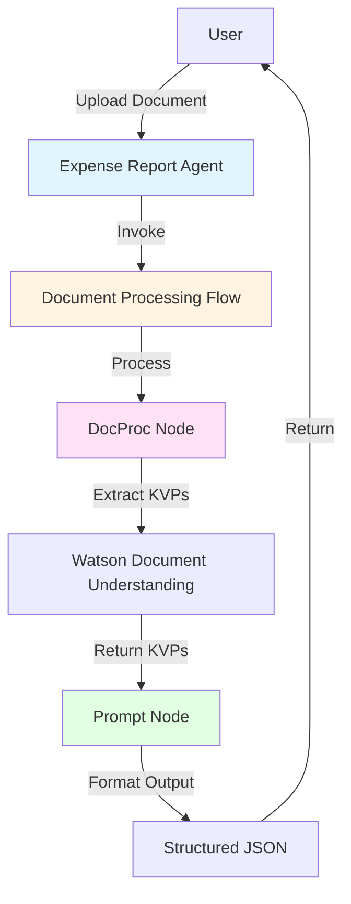
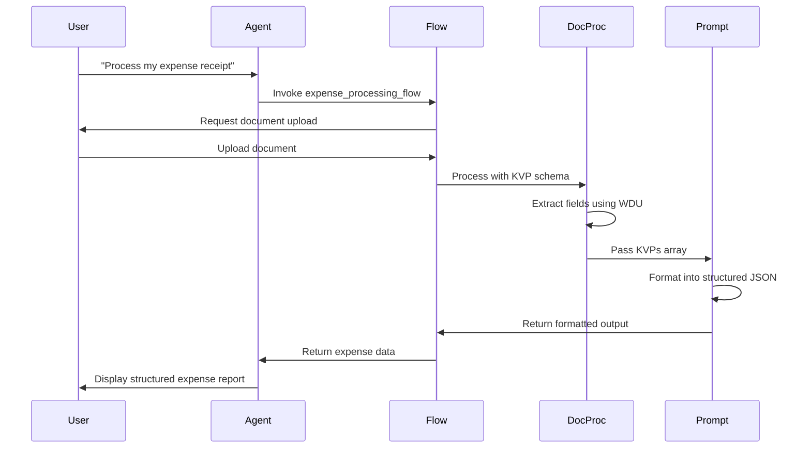

# Expense Report Agent - Implementation Plan

## Overview

This plan outlines the implementation of a watsonx Orchestrate agent that processes expense documents (airline tickets, hotel invoices, general receipts) and extracts structured expense data using Watson Document Understanding with KVP (Key-Value Pair) extraction.

## Architecture



## Design Decisions

Based on user requirements:
- ✅ **Single comprehensive KVP schema** for all expense types (airline, hotel, general)
- ✅ **Structured JSON output** with formatted summary via LLM prompt node
- ✅ **Auto-processing** with confidence scores included in output
- ✅ **Support for invoices and receipts** (airline, hotel, general expenses)

## Project Structure

```
expense_report_agent/
├── tools/
│   └── expense_processing_flow.py    # Main document processing flow
├── agents/
│   └── expense_report_agent.yaml     # Agent configuration
├── main.py                            # Testing script
├── import-all.sh                      # Deployment script
└── README.md                          # Documentation with diagrams
```

## Implementation Details

### 1. KVP Schema Design

The schema will use `DocProcKVPSchema` and `DocProcField` to define all required fields:

**Invoice Information:**
- `invoice_date` - Date of the invoice/receipt
- `transaction_mode` - Payment method (Credit Card, Bank Transfer, Cash, etc.)

**Airline Information (Optional):**
- `airline_name` - Name of the airline
- `passenger_name` - Name of the passenger
- `ticket_number` - Airline ticket number
- `ticket_date` - Date of ticket issuance
- `flight_details` - Flight number, route, departure/arrival times

**Hotel Information (Optional):**
- `hotel_name` - Name of the hotel
- `customer_name` - Name of the guest
- `city` - City where hotel is located

**Fee Information:**
- `base_fare` - Base charges/fare amount
- `taxes` - Tax amount with breakdown if available
- `total_amount` - Total amount due
- `currency` - Currency code (USD, EUR, etc.)

### 2. Document Processing Flow

The flow will:
1. Accept a document upload via `DocProcInput`
2. Use `docproc` node with:
   - `task="text_extraction"`
   - `output_format=DocProcOutputFormat.object` (returns JSON directly)
   - `document_structure=True` (includes document structure)
   - `enable_hw=True` (supports handwritten text)
   - `kvp_schemas=[EXPENSE_KVP_SCHEMA]` (our comprehensive schema)
3. Pass KVPs to a prompt node for formatting
4. Return structured JSON output

### 3. Agent Configuration

The agent will:
- Be named "Expense Report Agent"
- Have clear instructions to invoke the flow when user wants to process an expense document
- **NOT** ask user to upload document first (flow handles upload)
- Provide helpful context about supported document types

### 4. Output Schema

```python
class ExpenseReportOutput(BaseModel):
    # Invoice Information
    invoice_date: str = Field(default="", description="Date of invoice/receipt")
    transaction_mode: str = Field(default="", description="Payment method")
    
    # Airline Information (if applicable)
    airline_name: str = Field(default="", description="Airline name")
    passenger_name: str = Field(default="", description="Passenger name")
    ticket_number: str = Field(default="", description="Ticket number")
    ticket_date: str = Field(default="", description="Ticket date")
    flight_details: str = Field(default="", description="Flight information")
    
    # Hotel Information (if applicable)
    hotel_name: str = Field(default="", description="Hotel name")
    customer_name: str = Field(default="", description="Customer name")
    city: str = Field(default="", description="City")
    
    # Fee Information
    base_fare: str = Field(default="", description="Base fare/charges")
    taxes: str = Field(default="", description="Tax amount")
    total_amount: str = Field(default="", description="Total amount")
    currency: str = Field(default="", description="Currency code")
    
    # Summary
    summary: str = Field(description="Human-readable summary of the expense")
```

## Flow Diagram



## Key Implementation Patterns

### Pattern 1: Document Processing with KVP
- Use `DocProcKVPSchema` wrapper for schema definition
- Use `DocProcField` for each field with description, example, and default
- Set `output_format=DocProcOutputFormat.object` for inline JSON
- Map KVPs to prompt node for intelligent formatting

### Pattern 2: Agent Instructions
```yaml
instructions: |
  When the user wants to process an expense document (airline ticket, 
  hotel invoice, or receipt), immediately invoke the expense_processing_flow 
  tool. The flow will prompt the user to upload the document.
  
  Do NOT ask the user to upload the document first - the flow handles this.
```

### Pattern 3: KVP Structure Handling
- KVPs returned as list with `key.semantic_label` and `value.raw_text`
- Pass entire KVP array to prompt node (recommended approach)
- Let LLM intelligently parse and format the data
- Include system_prompt (required for prompt nodes)

## Testing Strategy

1. **Unit Testing**: Test flow with sample documents
2. **Integration Testing**: Test agent invocation and flow execution
3. **Document Variety**: Test with:
   - Airline tickets (various airlines)
   - Hotel invoices (various hotels)
   - General receipts (restaurants, taxis, etc.)
   - Mixed quality (clear vs. poor scans)
   - Handwritten receipts

## Deployment Steps

1. Create all necessary files in project structure
2. Test locally using `main.py`
3. Make `import-all.sh` executable
4. Run import script to deploy to watsonx Orchestrate
5. Test in chat UI
6. Verify output format and accuracy

## Success Criteria

- ✅ Agent successfully processes all three document types
- ✅ Extracts all required fields with high accuracy
- ✅ Returns structured JSON output
- ✅ Handles missing fields gracefully (empty strings)
- ✅ Provides human-readable summary
- ✅ Works with both printed and handwritten documents
- ✅ Clear error messages for unsupported documents

## Next Steps

1. Implement KVP schema with all required fields
2. Create document processing flow
3. Configure agent YAML
4. Create testing and deployment scripts
5. Write comprehensive documentation
6. Test with sample documents
7. Deploy to watsonx Orchestrate

## Technical Notes

### Important Constraints
- Expression mappings must be single-line Python expressions
- Cannot define or call Python functions in expressions
- Use list comprehensions for KVP field extraction
- Prompt nodes require `system_prompt` parameter
- Flow signature must be: `def build_<flow_name>(aflow: Flow) -> Flow:`

### Best Practices
- Use descriptive field names matching schema semantic_labels
- Include clear examples in DocProcField definitions
- Add additional_prompt_instructions for extraction guidance
- Use prompt node for complex KVP formatting (recommended)
- Include confidence scores in output for transparency
- Handle optional fields with default empty strings

## Resources

- [Document Processing Nodes](https://developer.watson-orchestrate.ibm.com/tools/flows/document_processing_nodes)
- [KVP Extraction Guide](https://developer.watson-orchestrate.ibm.com/tools/flows/document_processing_nodes#semantic-key-value-pair-kvp-extraction)
- [Flow Builder Documentation](https://developer.watson-orchestrate.ibm.com/tools/flows/overview)
- [Agent Configuration](https://developer.watson-orchestrate.ibm.com/agents/build_agent)